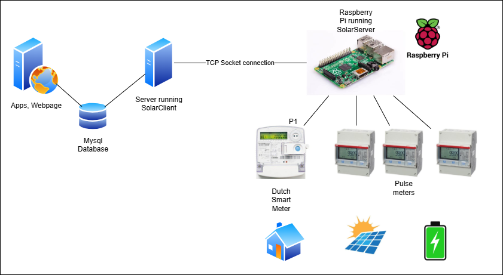
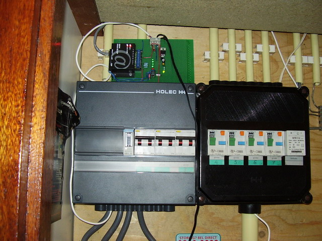
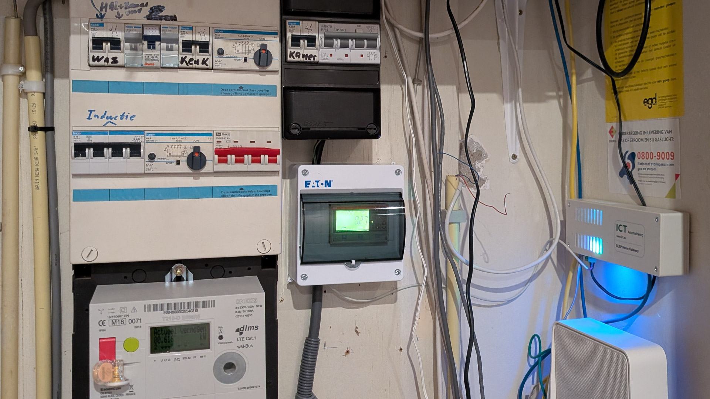

# The SolarPower Project
## Introduction
The goal of this project is to monitor the PV system (photovoltaic system or solar system) and monitor energy usage. The project consists of two applications:

* The **solarserver**  
  This is an application for reading out pulse meters and the NTA8130 Dutch Smart Meter P1 port ([DSMR 5.0](https://www.netbeheernederland.nl/publicatie/dsmr-502-p1-companion-standard)). It stores measurement values in memory for read out by the solarclient application. It also offers the feature of publishing real-time measurements. It is intended for the Raspberry Pi. 
* The **solarclient**  
  This application connects to the solarserver and downloads the measurement data and stores it in a mysql database. From here, it can be presented e.g. by means of a website or application.

Dependencies are towards [libsockets](https://libwebsockets.org/), [wiringPi](https://github.com/WiringPi/WiringPi) and [rabbitmq-c](https://github.com/alanxz/rabbitmq-c).

**Note: do not expect a production grade program with a fancy user interface. It is fully command line driven.**

## Architecture
Next diagram shows the set-up



* The Dutch smart meter measures the net consumption and production of the household and power quality measures (power failues, sags, swells, voltage, etc). Since v6.2 the software reads all smart meter P1 values and store them in the database
* Up to 3 pulse meters may be used to measure individual production or consumption, e.g. gross production of the solar panels  
  A pulse meter can be configured to measure production or to measure consumption
* The SolarServer reads out pulse meters and Dutch smart meter every 5 minutes and stores the data in a storage in memory
* The SolarClient reads out the stored information and stores it in a MySQL database; it initiates the connection for this

The philosophy at the time of creation (2007) was that the SolarServer is always running, whereas the server running SolarClient may be off-line sometimes for prolonged periods(e.g. during vacations).
Of course at current state of technology this is not the most logical choice: it would make more sense to have SolarServer upload the measuremement data to a central storage (on premise or in the cloud).

The stored data can be used to feed apps or web pages. For now these are out of scope for this project.

## History
The project was started by me in 2007, when I installed a PV system (1440 Wpp) and wanted to measure the production. The first version of solarserver ran on a [Beck DK40 IPC@Chip](https://isa.umh.es/micros/doc/sc12/DK40-Manual_engV2_020502.pdf), which is a single chip PC.



In 2013 the software was adapted for Raspberry PI.
By that time the NTA8130 Dutch Smart Meter was introduced. Software has been adapted since.

In 2026 the software was updated thoroughly (version 6.0) and put onto [github](https://github.com/scubajorgen/SolarPower) and again made operational for our home with 5500 Wpp solar PV intallation. Current project can be found on [https://energy.studioblueplanet.net](https://energy.studioblueplanet.net).


The picture above shows the current setup: bottom left the T210-D Smart Meter, mid right the Raspberry Pi in a nice enclosure, in the middle the ABB B23 meter in a enclosure.

## Prequisites
During the project the Raspberry Pi Model 1 B+ was used. This page assumes this device. Prerequisite is some kind of interfacing between 
* the Raspberry Serial port and the P1 port
* the Raspberry I/O pins and the pulse meter pulse output

Pulse meters should have a pulse width of at least 100 ms. Sample frequency used by the software is 10 milliseconds. Pulse meters should ideally measure energy only in one way. Most pulse meters (like the popular Eastron SM72D) measure in both directions and generate a pulse for consumption and production. 
A pulse meter that generates pulses for only one direction is for example the ABB B23. The cheapest version (B23 112–10E) has one pulse output that can be programmed and it generates pulses only in one direction.
The reason to have unidirectional pulses is that the software calculates gross energy usage (which is net energy usage plus production). PV systems generally have some energy consumption at night time. Having a meter that also generates pulses for consumption disturbsn the gross energy usage calculation.


# Installation
## Preparing the Raspberry Pi and building solarserver

* Install *Rasberry Pi OS Lite (32-bit)*, image  to a flash card, e.g. using Raspberry Pi Imager
* Get the Raspberry Pi up and running.
* Make sure Serial Port 0 (/dev/ttyAMA0) is not used as terminal. Use **raspi-config**:  
  5 Interfacing Options -> P6 Serial -> 'Would you like a login shell to be accessible over serial?' = no
  ```
  sudo raspi-config
  >  3 Interface Options
  >  I6 Serial Port
  >  Would you like a login shell to be accessible over serial? <No>
  >  Would you like the serial port hardware to be enabled? <Yes>
  > <Ok>
  > <Finish>
  ```
* Update:  ```sudo apt-get update```
* Install libwebsockets, if you are going to use websockets:  
  ```
    sudo apt-get install libwebsockets-dev
  ```
* Install wiringPi  
  Get the latest armhf release from the [WiringPi github](https://github.com/WiringPi/WiringPi/releases), at time of writing it was 3.16
  ```
  cd
  wget https://github.com/WiringPi/WiringPi/releases/download/3.16/wiringpi_3.16_armhf.deb
  sudo dpkg -i wiringpi_3.16_armhf.deb
  ```
* If you are going to use AMQP (e.g. RabbitMQ), download and install [rabbitmq-c](https://github.com/alanxz/rabbitmq-c), latest release (at time of writing 0.15.0)  
  ```
    wget https://github.com/alanxz/rabbitmq-c/releases/tag/v0.15.0
    tar -xzvf rabbitmq-c-0.15.0.tar.gz
    cd rabbitmq-c-0.15.0/
    mkdir build
    cd build
    cmake ..
    cmake --build .
    sudo make install
  ```
* Copy sources of solarserver using samba, scp, or whatever
* Build:  
  ```
  make clean
  make
  ```
* Create or adapt config.ini
* Run  
  ```
  ./Solar
  ```

Optional, modify according to own flavour:
* Install Joe's Own Editor (joe)
  ```
  sudo apt-get install joe
  ```
* [Install Samba](https://raspberrypi.tilburgs.com/samba/)  
  ```
  sudo apt-get install samba samba-common-bin
  sudo smbpasswd -a [user]
  ```
  Add to /etc/samba/smb.conf
  ```
  workgroup = your_workgroup_name
  wins support = yes
  ...
  [userhome]
   comment = User Home
   path = /home/%U
   public = no
   writable = yes
  ```
  Restart
  ```
  sudo service samba restart
  ```
* Install screen  
  ```
  sudo apt-get install screen
  ```

## Building solarclient
Run the software on a Linux machine or server; it might even work under Windows using g++ and MinGW.
* Building
  ```
  make clean
  make
  ```
* Create MySQL database using the script createdb.sql from within mysql
  ```
  source createdb.sql
  ```
  Grant privileges to a user
* Add or modify config.ini
  Add the database, database credentials, solarserver address, etc
* Run
  ```
  ./SolarClient
  ```

## Simulation mode
When setting ```simulation_mode 1``` in the config.ini file of solarserver, it simulates pulse meters and a Dutch smart meter providing a P1 datagram every 5 minutes. Pulse meter 0 simulates a PV system generating a maximum power of 5000 Watt. The Dutch Smart meter plays some energy usage pattern.
The simulated data is presented in an [excel file](doc/simulation.xlsx).

# Testing
## SERIAL PORT TEST
sudo apt-get install python-serial

python p1.py

Note that some meters have inverted signals.

# CONFIGURATION
Configuration is in config.ini. All values must be set and must
be valid!

# License
This software is published under the MIT license:

*Copyright (c) 2026 Jörgen*

*Permission is hereby granted, free of charge, to any person obtaining a copy
of this software and associated documentation files (the "Software"), to deal
in the Software without restriction, including without limitation the rights
to use, copy, modify, merge, publish, distribute, sublicense, and/or sell
copies of the Software, and to permit persons to whom the Software is
furnished to do so, subject to the following conditions:*

*The above copyright notice and this permission notice shall be included in all
copies or substantial portions of the Software.*

*THE SOFTWARE IS PROVIDED "AS IS", WITHOUT WARRANTY OF ANY KIND, EXPRESS OR
IMPLIED, INCLUDING BUT NOT LIMITED TO THE WARRANTIES OF MERCHANTABILITY,
FITNESS FOR A PARTICULAR PURPOSE AND NONINFRINGEMENT. IN NO EVENT SHALL THE
AUTHORS OR COPYRIGHT HOLDERS BE LIABLE FOR ANY CLAIM, DAMAGES OR OTHER
LIABILITY, WHETHER IN AN ACTION OF CONTRACT, TORT OR OTHERWISE, ARISING FROM,
OUT OF OR IN CONNECTION WITH THE SOFTWARE OR THE USE OR OTHER DEALINGS IN THE
SOFTWARE.*